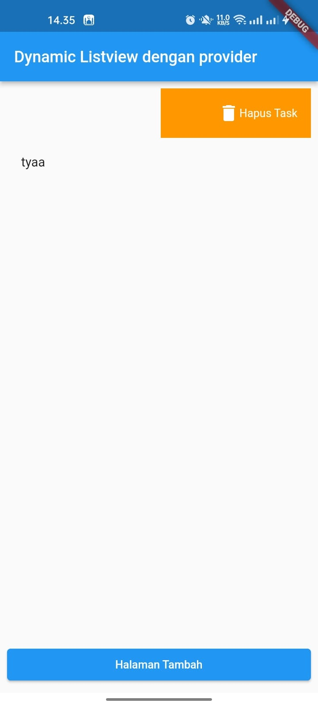

# Listview dengan Provider

Challenge untuk UTS Kerjakan salah satu saja 100 :

1. Tambahkan fitur untuk validasi input di tambah task.
 

 
 

 

2. Tambahkan fitur untuk disable button tambah task jika validasi input masih error.
 

 

3. Tambahkan fitur swipe left delete task
 

 

4. Tambahkan fitur swipe right go to edit task page
 

 

5. Tambahkan fitur edit task.
 

 

6. Tambahkan fitur validasi input di edit task.
 

 

7. Tambahkan fitur disable button edit task jika validasi input masih error.
 

 
